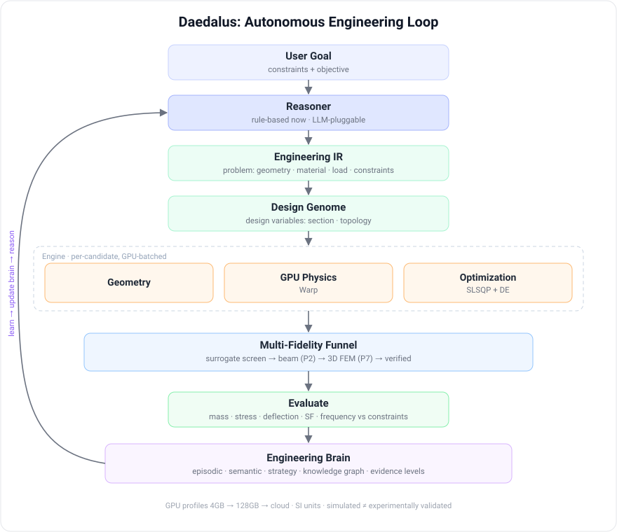

<!-- English: [README.md](README.md) -->

<div align="center">


# Daedalus Engineering AI

**자율 엔지니어링 설계 에이전트**

[](LICENSE)
[](https://www.python.org/)
[](https://github.com/NVIDIA/warp)
[](https://pytorch.org/)
[](#현재-상태)
[](#현재-상태)

</div>

공학 목표만 주면 추론 → 설계 → GPU 물리 → 최적화 → 학습을 반복해 로봇 부품을
설계하고, 배운 것을 **Engineering Brain**에 축적한다. Brain의 모든 주장에는
**증거수준**이 명시된다.

에이전트와 CLI의 브랜드는 **Daedalus**이다.

---

## 현재 상태

Phase 0~6 구현·검증 완료.

| phase | 내용 | 상태 |
|---|---|---|
| 0 | venv, 프로젝트 골격, GPU 프로파일, Warp/torch 새너티 | 완료 |
| 1 | Engineering IR(문제), 재료 DB, Design Genome(설계변수) | 완료 |
| 2 | NVIDIA Warp 기반 미분가능 GPU 보 물리 | 완료 |
| 3 | 제약 하 질량 최소화 (SLSQP + 차분진화) | 완료 |
| 4 | 자율 설계 루프: 상태머신, 에피소드, 예산, 탐색/활용 | 완료 |
| 5 | Engineering Brain: 에피소드/의미 기억, 증거수준, 검색 | 완료 |
| 6 | PyTorch surrogate + 2단계 screen-and-verify | 완료 |
| 7 | 고정밀 3D FEM (응력집중·좌굴) | 예정 |

**MVP 문제**: 중공 사각단면 로봇 링크 1개의 질량 최소화. 근부 고정 캔틸레버,
팁에 196.2 N(20 kg 페이로드), 알루미늄 7075-T6, 응력 상한·팁 처짐 한계·안전율
제약.

**결과: 1.686 kg → 0.250 kg, 질량 85.2% 감소.** 서로 독립적인 두 최적화기가
상대차 1.3×10⁻⁵로 일치. 이 설계는 **처짐 지배(deflection-limited)** 다.
팁 처짐이 1 mm 한계에 정확히 붙는 반면 응력 제약은 70% 넘는 여유가 남는다.

**테스트 281개 통과.** 중요 계산은 전부 별도로 유도한 독립 레퍼런스와 대조 검증.

---

## 아키텍처

<p align="center"></p>

목표는 **Engineering IR**(문제: 형상·재료·하중·제약·목표, 전부 고정)로 들어온다.
**Design Genome**은 탐색이 바꿔도 되는 것만 담으며 현재는 단면 치수다. 후보는
엔진(지오메트리, GPU 물리, 최적화)을 거쳐 **다중 충실도 깔때기**를 내려간다:
surrogate가 수천 개를 걸러내고, 보 이론이 후보군을 평가하며, 3D FEM이 최종
관문이다. 결과는 제약과 대조해 판정되고, 매 이터레이션은 증거수준이 붙은 채
**Engineering Brain**에 기록되어 다음 회차에 reasoner가 읽는다.

핵심 분리는 물리가 문제 없이 genome만 보는 일이 절대 없다는 것이다. 그래서 설계
변수가 조용히 요구사항으로 둔갑할 수 없다.

## 하드웨어 & GPU 프로파일

**RTX 3050 Laptop GPU (4 GB)** 에서 개발·검증했다. 규모는 코드에서 분리되어
`configs/profiles/*.yaml` 에 산다.

| 프로파일 | VRAM | 성격 |
|---|---|---|
| `laptop_4gb` | 4 GB | 현재 목표. 후보풀 작게, AMP + gradient checkpointing |
| `desktop_16gb` | 16 GB | 중급 워크스테이션 |
| `rtx5090_32gb` | 32 GB | 고대역폭. 이 워크로드에서 solve가 가장 빠름 |
| `dgx_spark_128gb` | 128 GB | 대용량·저대역폭. 큰 모델용, solve는 느림 |
| `cloud_a100` | 80 GB | 대규모 병렬 |

선택 우선순위: `--profile` → `ENG_PROFILE` 환경변수 → VRAM 자동감지 → fallback.

```bash
python -m interfaces.cli.main info                     # 자동감지
python -m interfaces.cli.main info --profile cloud_a100
ENG_PROFILE=desktop_16gb python -m interfaces.cli.main info
```

**시스템 CUDA 툴킷은 불필요하다**: Warp가 커널을 자체 JIT하고, torch는 CUDA
런타임을 휠에 포함해 배포한다.

---

## 시스템 요구사양

실제로 돌려본 것과 제공 프로파일에 근거한 값이다. 희망사항이 아니다.

### 소프트웨어

| | 요구사항 |
|---|---|
| OS | **Linux**: 개발·검증 플랫폼. Windows/macOS는 **TBD / 실험적**, 아직 검증 안 됨 |
| Python | **3.10+** (3.10.12에서 검증) |
| GPU 드라이버 | 번들된 torch/warp의 CUDA 런타임을 지원하는 NVIDIA 드라이버. **시스템 CUDA 툴킷은 필요 없음** |
| 디스크 | **약 6 GB**: venv가 약 5 GB(torch + Warp CUDA 휠), 여기에 `datasets/`·`runs/` 여유분 |

### 하드웨어

| 티어 | GPU | CPU / RAM | 프로파일 |
|---|---|---|---|
| **최소** (MVP·개발) | NVIDIA VRAM 4 GB (예: RTX 3050) | 8코어 / 16 GB | `laptop_4gb` |
| **권장** | VRAM 16 GB 이상 (RTX 4070 Ti / 4080, 중고 3090 24 GB) | 8코어+ / 16~32 GB | `desktop_16gb`, `rtx5090_32gb` |
| **대규모** | VRAM 24~48 GB+ (4090 / 5090 / A6000) 또는 클라우드 A100 80 GB | 16코어+ / 64 GB+ | `cloud_a100` |
| **CPU 전용** | 없음, Warp에 CPU 디바이스가 있음 |, | 동작은 하나 **느리고 제한적**. GPU를 강력히 권장 |

---

## 설치 (개발용)

```bash
python3 -m venv .venv
env -u PYTHONPATH .venv/bin/python -m pip install -U pip wheel
env -u PYTHONPATH .venv/bin/pip install -r requirements.txt
env -u PYTHONPATH .venv/bin/python scripts/gpu_sanity.py
```

> **venv는 깨끗한 `PYTHONPATH`에서 실행할 것.** 셸에 source된 다른 환경이
> `PYTHONPATH`를 내보내면 그쪽의 오래된 패키지가 venv 패키지를 가릴 수 있다
> (예를 들어 다른 버전의 `numpy`가 조용히 먼저 잡힌다). `env -u PYTHONPATH`를
> 앞에 붙이면 피할 수 있다. 아래의 부트스트랩 설치 스크립트는 이 래핑을 자동
> 처리해서 최종 사용자가 신경 쓸 필요 없게 하는 것이 목표다.

`gpu_sanity.py`는 Warp를 초기화하고, 실제 커널을 컴파일·실행해 결과를 검증하고,
torch CUDA를 확인하고, 선택된 프로파일을 출력한다.

---

## 사용법

현재는 전부 `python -m interfaces.cli.main <command>` 형태다. 아래의 패키징된
CLI에서는 `dae <command>` 로 노출된다.

### `evaluate`: 설계 하나를 GPU에서 평가

```bash
python -m interfaces.cli.main evaluate --width 50 --height 80 --thickness 5
```

```
              evaluated metrics (Euler-Bernoulli beam theory)
┃ quantity              ┃             SI ┃   readable ┃   limit ┃ verdict ┃
│ mass                  │       1.686 kg │  1.6860 kg │       - │    -    │
│ max bending stress    │ 3.96364e+06 Pa │  3.964 MPa │ 120 MPa │  PASS   │
│ tip deflection        │  0.000115168 m │  0.1152 mm │ 1.00 mm │  PASS   │
│ safety factor         │        126.904 │     126.90 │     2.0 │  PASS   │
│ 1st natural frequency │     324.761 Hz │   324.8 Hz │       - │    -    │
```

### `optimize`: 질량 최소화, 두 방법으로 교차검증

```bash
python -m interfaces.cli.main optimize --method both
```

```
┃ quantity           ┃    baseline ┃       SLSQP ┃ DifferentialEvolution ┃
│ b (mm)             │      50.000 │      10.000 │                10.000 │
│ h (mm)             │      80.000 │      80.960 │                80.958 │
│ t (mm)             │       5.000 │       1.000 │                 1.000 │
│ mass (kg, SI)      │    1.686000 │    0.249977 │              0.249973 │
│ delta_tip (mm)     │     0.11517 │     1.00000 │               1.00004 │
│ mass reduction     │           - │       85.2% │                 85.2% │
│ active constraint  │        none │  deflection │            deflection │
cross-verification: |SLSQP - DE| / SLSQP = 1.341e-05 (0.0013%)  AGREE
```

### `run`: 자율 설계 루프

```bash
python -m interfaces.cli.main run --iterations 6 --seed 1          # 라이브 TUI
python -m interfaces.cli.main run --no-tui --target-mass 0.30      # 헤드리스
```

```
 # │ action  │ strategy          │ mass (kg) │ feasible │ best │ evals
 0 │ exploit │ initial-exploit   │  0.249977 │   yes    │ NEW  │   196
 1 │ explore │ explore-scheduled │  0.249976 │   yes    │ NEW  │   349
 4 │ explore │ explore-on-stall  │  0.249977 │   yes    │  -   │    14

  termination  converged
       detail  4 consecutive iterations improved by less than 0.100%
       budget  964/20000 evaluations, 10.2/300 s
```

옵션: `--iterations`, `--seed`, `--target-mass`, `--max-evaluations`,
`--max-seconds`, `--profile`, `--tui/--no-tui`.

### `brain`: 축적된 경험 조회

```bash
python -m interfaces.cli.main brain --generalize
```

```
┃ level    ┃  conf ┃ evidence ┃ runs ┃ statement                          ┃
│ repeated │ 0.692 │        9 │    3 │ For cantilever_link designs, the   │
│          │       │          │      │ binding constraint is 'deflection' │
│          │       │          │      │ (active in 9/9 feasible episodes). │
```

---

## 충실도와 안전성: 숫자를 믿기 전에 읽을 것

이 프로젝트를 다른 것과 구분 짓는 부분이다. 각 계층은 자신이 **모르는 것**을
명시한다.

**물리(Phase 2)는 Euler–Bernoulli 보 이론이다.** 근부 응력집중을 무시하고,
전단 변형을 무시하며, 좌굴을 검사하지 않는다. **실제 근부 최대응력은 보고값보다
높다**: 보고된 응력은 하한으로 취급할 것. 여기를 통과한 설계는 **후보이지
검증된 부품이 아니다.**

**surrogate(Phase 6)가 근사하는 것은 그 보 이론 평가기이지 3D FEM이 아니다.**
그래서 오차가 보 이론 오차 위에 더해진다. 그리고 surrogate는 결정하지 않는다: 
`screen_and_verify`는 수천 후보를 모델로 순위 매기지만, 반환하는 설계는 항상
**솔버가 실제로 평가한** 것이다. 또한 **현재 속도 이득은 없다**: 보 커널이
닫힌 형태 산술이라 surrogate 처리량은 배치 솔버의 약 0.38배다. 가치는 Phase 7에서
발현된다.

**Brain(Phase 5)은 사실이 아니라 증거수준이 표시된 경험을 저장한다.**
`EXPERIMENTALLY_VALIDATED`는 **물리시험 증거로만** 도달 가능하다: 시뮬레이션을
아무리 많이 돌려도, 테스트 스위트를 전부 통과해도, 해석적으로 유도해도 그
관문은 열리지 않는다. 독립성은 에피소드가 아니라 **run 단위**로 세므로, 한 번의
긴 탐색은 최대 `SIMULATED`에 머문다.

**reasoner(Phase 4)는 규칙기반 휴리스틱이지 언어모델이 아니다.** 이걸 AI 추론이라
부르면 과대주장이다. `Reasoner`는 메서드 하나짜리 ABC이며, 그것이 LLM 정책을
끼워 넣도록 문서화된 이음매다.

**최적해는 가정된 제조 bound에 의존한다.** 설계변수 3개 중 2개가 bound에 붙어서
끝나고, 그중 1 mm 최소 벽 두께는 유도된 값이 아니라 **[ASSUMED]** CNC 알루미늄
한계다. 공정이 바뀌면 달성 가능한 질량도 함께 바뀐다.

---

## 설치·배포 (설치형 CLI): 열린 설계

이 프로젝트를 **자체적으로 완결된 설치형 CLI 도구**로 패키징하는 것이 목표다.
사용자가 한 번 설치하면 깔끔한 단일 명령으로 쓰는 형태. 제안하는 방향:

- `pyproject.toml`에 **console entry point**를 정의해 설치하면 `dae` 단일
  명령이 생기게 한다(긴 별칭으로 `daedalus`도 제공). 이미 Typer 기반이라
  자연스럽다.
- **`pipx`로 격리 설치**하거나, **부트스트랩 설치 스크립트**가 venv 생성 + GPU
  의존성(Warp / torch) 설치 + **깨끗한 `PYTHONPATH` 래핑까지 자동 처리**해서
  사용자가 환경 오염을 신경 쓰지 않게 한다.
- 현재 `interfaces/cli`의 명령들이 그 단일 진입점의 서브커맨드가 된다:

  ```bash
  dae evaluate --width 50 --height 80 --thickness 5
  dae optimize --method both
  dae run --iterations 6
  dae brain --generalize
  ```

- PyInstaller 단일 바이너리는 **후순위**: torch·Warp CUDA 휠 때문에 현실적이지
  않다.

> **이건 확정안이 아니다. 패키징·설치 UX는 아직 설계 중이며, 접근법에 대한
> 제안과 의견을 환영한다.**

### 릴리즈 설치 방법

> 설치 방법은 릴리즈 시 확정된다. **제안 환영.**

| 방법 | 상태 |
|---|---|
| pip | `TBD, 릴리즈 시 제공` |
| pipx | `TBD, 릴리즈 시 제공` |
| PowerShell (Windows) | `TBD, 릴리즈 시 제공` |
| cmd (Windows) | `TBD, 릴리즈 시 제공` |
| bash / curl (Linux, macOS) | `TBD, 릴리즈 시 제공` |
| Node / npx | `TBD, 릴리즈 시 제공` |
| Docker | `TBD, 릴리즈 시 제공` |

**pip**
```
# TBD, 릴리즈 시 제공
```

**pipx**
```
# TBD, 릴리즈 시 제공
```

**PowerShell (Windows)**
```
# TBD, 릴리즈 시 제공
```

**cmd (Windows)**
```
# TBD, 릴리즈 시 제공
```

**bash / curl (Linux, macOS)**
```
# TBD, 릴리즈 시 제공
```

**Node / npx**
```
# TBD, 릴리즈 시 제공
```

**Docker**
```
# TBD, 릴리즈 시 제공
```

---

## 로드맵

- **Phase 7: 고정밀 3D FEM**: 응력집중과 좌굴. 후보가 실물 부품으로 취급되기
  위해 통과해야 하는 관문이며, surrogate 인프라가 실제로 값어치를 하는 지점이다.
- **이방성 재료**: CFRP와 3D 프린팅 플라스틱은 방향별 물성 필드 **와** 이방성
  솔버가 먼저 있어야 한다. 지금의 단일 E 스키마에 밀어 넣으면 자신 있게 틀린
  답을 낸다.
- **토폴로지 최적화**, implicit/SDF 지오메트리, 라티스 구조.
- 기존 `Reasoner` ABC에 꽂는 **LLM 기반 reasoner**.
- **멀티 GPU device pool**: 독립 후보 병렬은 선형 확장된다.
- 제조 인계를 위한 **CAD / STEP export**.
- **부품 범위 확장**: 링크 → 관절 → 감속기 → 다리 → 휴머노이드.
- Brain의 **텍스트 임베딩 의미검색 + ANN 인덱싱** (현재 검색은 수치 특징
  유사도이며, 의도적으로 의미검색이라 부르지 않는다).
- 축적된 경험 데이터로 **도메인 특화 모델 fine-tuning**.

---

## 함께한 사람들

<p align="center">
<a href="https://github.com/SeongminJaden"></a>
</p>

<!-- To add a contributor, add another <a></a> beside the one above.
     For an auto-updating grid with circular avatars, replace the block with:
[](https://github.com/SeongminJaden/daedalus-engineering-ai/graphs/contributors)
     Note: GitHub strips style attributes from README HTML, so hand-written
     avatars render square. contrib.rocks is what produces round ones. -->

기여를 환영한다. **[CONTRIBUTING.md](CONTRIBUTING.md)** 참고. 이 프로젝트가
중요하게 여기는 건 기여의 양이 아니라 하나의 습관이다: 각 계층이 자신이
**모르는 것**을 명시하고, 중요한 계산은 독립적인 방법으로 검증하며, 과대주장을
하지 않는 것. 그 성질을 지키는 변경이 이 프로젝트가 원하는 기여다.

---

## 후원

*아직 후원자가 없다: 이 자리는 첫 후원자를 기다린다.*

이 작업이 도움이 되어 후원하고 싶다면, 후원 경로가 준비되는 대로 여기에 표시된다.
`.github/FUNDING.yml`은 주석 처리된 템플릿으로만 들어 있다. 동작하지 않는 후원
링크는 없느니만 못하기 때문에 아직 아무것도 활성화하지 않았다.

---

## 커뮤니티

[](#커뮤니티)

**Discord: `TBD, 서버 개설 후 링크 삽입`**

아직 초대 링크가 없고, 여기서 지어내지도 않는다. 서버가 생기기 전까지는 GitHub
**Issues**와 **Discussions**가 질문·제안·설계 토론의 장소다. 특히 위에서 열어둔
두 가지 질문에 대한 의견을 환영한다: **패키징·설치 UX**, 그리고 **충실도 모델에서
틀렸다고 생각하는 부분**. 어떤 숫자가 오해를 부른다고 지적받는 것이 이 프로젝트가
받을 수 있는 가장 유용한 기여다.

---

## 라이선스

[Apache License 2.0](LICENSE) © 2026 SeongminJaden. [NOTICE](NOTICE) 참고.

허용적 라이선스 대신 Apache-2.0을 고른 것은 **특허 방어**를 위한 의도적 선택이다.
모든 기여자로부터 명시적인 특허 실시권을 부여받고, 이 저작물에 대해 특허 소송을
제기하는 쪽에는 그 실시권이 종료된다. 특허 조항이 없는 라이선스는 기여자와
사용자를 바로 그 위험에 노출시킨다.

### 방어적 공개 (defensive publication)

방법론을 공개하는 것(`DESIGN.md`, 이 문서, 그리고 소스) 자체가 **prior art**를
성립시키려는 목적도 갖는다. 어떤 기법이 공개적으로, 날짜를 특정할 수 있게
기술되고 나면, 제3자가 같은 접근을 나중에 특허화해 이미 그것을 쓰고 있는
커뮤니티에 주장하기가 훨씬 어려워진다. 둘의 조합이 핵심이다: prior art가 아이디어를
선점당하지 않게 하고, Apache-2.0의 특허 grant와 보복 종료 조항이 그 위에서
개발하는 사람들을 보호한다.

---

## 저장소

`SeongminJaden/daedalus-engineering-ai`
